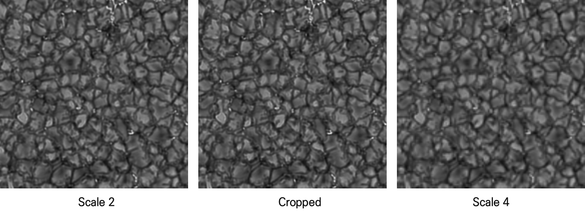
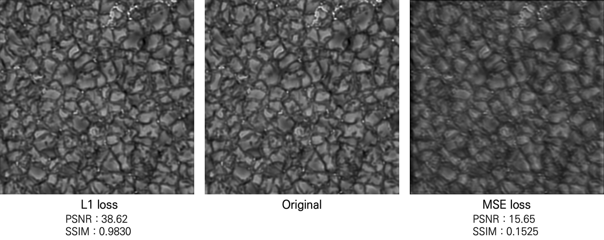
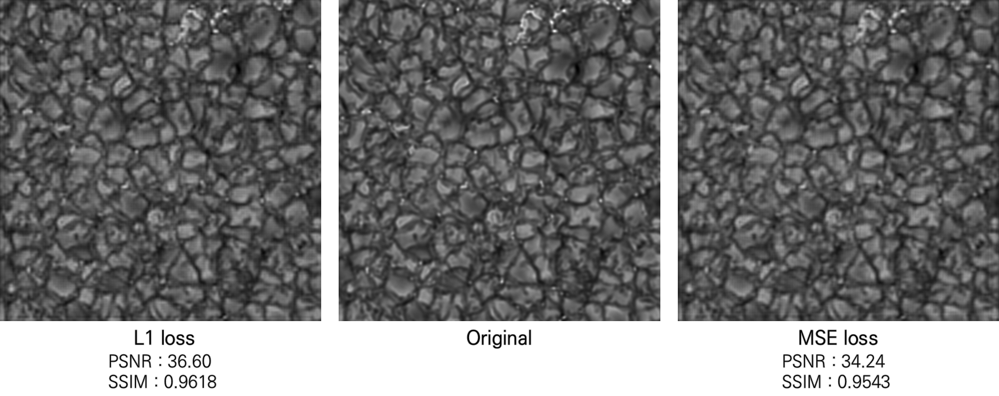
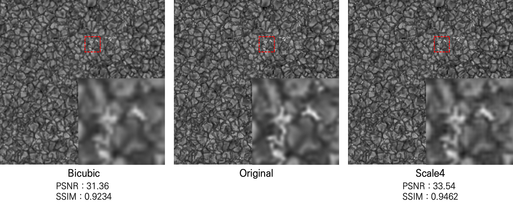
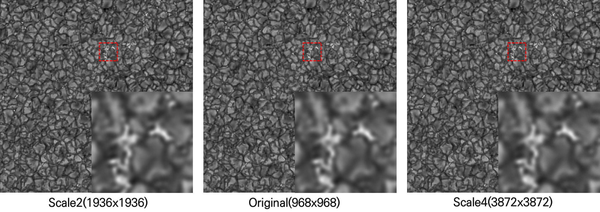

# HinodeSR
Apply super-resolution to HINODE dataset(granule imge) using RCAN

I fixed the original code to fit me(option.py, hinode.py, srdata.py and so on in RCAN_TrainCode)
Especially I used a single filter image, so I added a reshape code in srdata.py

I trained my dataset on Linux enviroment with TitanX GPU  
I just compared result with L1 and MSE loss  

Trained weight is uploaded on [here](https://drive.google.com/open?id=1ALXlsQUS1NLCsxk_nQ5VvDnKrzuei_5b)

## Summary
### Experiment cases
-|Loss function|Patch size|# of residual block|scale
---|---|---|---|---|
Case1|L1|100|15|2|
Case2|MSE|100|15|2|
Case3|L1|128|20|4|
Case4|MSE|128|20|4|
Case5|L1|128|20|2|
Case6|L1|192|20|4|

### Input data
Cropped: 512x512, Scale 2: 256x256, Scale 4: 128x128

### Result
The following images are the results of applying the best model in each case.
* Compare loss function

-|Case1(L1)|Case2(MSE)|Case3(L1)|Case4(MSE)
---|---|---|---|---|
Mean PSNR|39.56|16.7|36.98|34.97|
Mean SSIM|0.9845|0.1775|0.9627|0.9557|

* Compare with bicubic interpolation

-|Case6(scale 4)|Bicubic(scale 4)
---|---|---|
Mean PSNR|37.33|35.33|
Mean SSIM|0.9635|0.9456|

* Apply super-resolution to original data(968x968)

